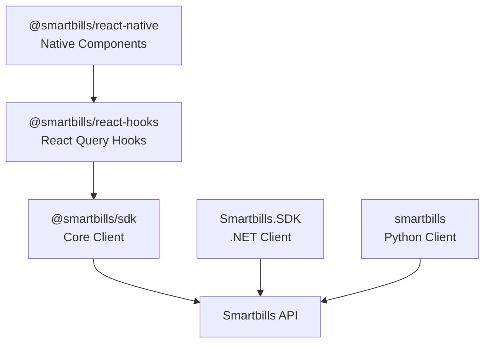

## Available SDKs

Smartbills provides official SDKs for JavaScript, TypeScript, React, React Native, Python, and .NET to help you integrate expense management, digital receipts, and financial automation into your applications.

<CardGroup cols={2}>
  <Card title="JavaScript SDK" icon="js" href="/sdks/javascript/overview">
    Core SDK for Node.js and browser applications, `@smartbills/sdk`
  </Card>
  <Card title="React Hooks" icon="react" href="/sdks/react-hooks/overview">
    React Query hooks for data fetching, `@smartbills/react-hooks`
  </Card>
  <Card title="React Native SDK" icon="mobile" href="/sdks/react-native/overview">
    Native receipt display and mobile components, `@smartbills/react-native`
  </Card>
  <Card title=".NET SDK" icon="microsoft" href="/sdks/dotnet/overview">
    C# SDK for .NET applications, `Smartbills.SDK`
  </Card>
  <Card title="Python SDK" icon="python" href="/sdks/python/overview">
    Python SDK for server-side applications, `smartbills`
  </Card>
</CardGroup>

## Installation

<CodeGroup>

```bash JavaScript / TypeScript
npm install @smartbills/sdk
```

```bash React (Hooks)
npm install @smartbills/sdk @smartbills/react-hooks @tanstack/react-query
```

```bash React Native
npm install @smartbills/react-native @smartbills/react-hooks @smartbills/sdk @tanstack/react-query
```

```bash .NET
dotnet add package Smartbills.SDK
```

```bash Python
pip install smartbills
```

</CodeGroup>

## Quick Start

All SDKs use the same authentication pattern with access tokens:

<CodeGroup>

```typescript JavaScript
import { SmartbillsClient } from "@smartbills/sdk";

const client = new SmartbillsClient({
  accessToken: "your-access-token",
  businessId: 42,
});

const { data } = await client.expenses.listBusiness({ limit: 25 });
```

```tsx React
import { SmartbillsProvider, useExpenses } from "@smartbills/react-hooks";
import { SmartbillsClient } from "@smartbills/sdk";

const client = new SmartbillsClient({ accessToken: "token", businessId: 42 });

function App() {
  return (
    <SmartbillsProvider client={client} businessId={42}>
      <ExpenseList />
    </SmartbillsProvider>
  );
}

function ExpenseList() {
  const { data, isLoading } = useExpenses({ limit: 25 });
  if (isLoading) return <div>Loading...</div>;
  return (
    <ul>
      {data?.pages.flatMap(p => p.data).map(e => (
        <li key={e.id}>{e.vendor?.name}</li>
      ))}
    </ul>
  );
}
```

```csharp C#
using Smartbills.SDK;

var client = new SmartbillsClient(new SmartbillsClientOptions
{
    AccessToken = "your-access-token",
    BusinessId = 42
});

var invoices = await client.Invoices.ListAsync(
    new InvoiceListRequest { Limit = 25 }
);
```

```python Python
from smartbills import SmartbillsClient

client = SmartbillsClient(
    access_token="your-access-token",
    business_id=42
)

expenses = await client.expenses.list(limit=25)
```

</CodeGroup>

## SDK Architecture



The JavaScript SDK (`@smartbills/sdk`) serves as the core client. The React Hooks SDK and React Native SDK build on top of it, adding React-specific data fetching and native mobile components. The .NET and Python SDKs are standalone clients that communicate directly with the Smartbills API.

## Authentication

All SDKs use OAuth 2.0 bearer tokens:

| Method | Use Case |
|--------|----------|
| Access Token | Server-side and client-side applications |
| OAuth 2.0 Flow | User-facing applications requiring login |

## Features

### Common Features

- **Type Safety**: Full TypeScript / C# / Python type definitions
- **Error Handling**: Typed error classes with guards (`isNotFoundError`, `isValidationError`, etc.)
- **Pagination**: Built-in support for paginated list endpoints
- **Retry Logic**: Automatic retry for transient failures with configurable backoff
- **Rate Limiting**: Automatic rate limit handling

### Feature Matrix

| Feature | JS SDK | React Hooks | React Native | .NET | Python |
|---------|--------|-------------|--------------|------|--------|
| Expense CRUD | Yes | Yes | Yes |: | Yes |
| Invoice CRUD | Yes | Yes | Yes | Yes |: |
| Bill Management | Yes | Yes | Yes |: | Yes |
| Vendor Management | Yes | Yes | Yes |: | Yes |
| Expense Reports | Yes | Yes | Yes |: | Yes |
| Bulk Operations | Yes | Yes | Yes |: | Yes |
| Presigned Upload | Yes | Yes | Yes |: |: |
| Receipt Display |: |: | Yes |: |: |
| Barcode / QR Code |: |: | Yes |: |: |
| Infinite Scroll |: | Yes | Yes |: |: |
| Optimistic Updates |: | Yes | Yes |: |: |
| File Management | Yes | Yes | Yes | Yes |: |
| Billing / Checkout |: |: |: | Yes |: |

<Info>
  The .NET SDK currently focuses on invoicing, file management, and billing. Additional service clients (expenses, vendors, reports) are planned for future releases.
</Info>

## Version Compatibility

| SDK | Minimum Runtime | API Version |
|-----|----------------|-------------|
| `@smartbills/sdk` | Node.js 16+ / Modern browsers | v1 |
| `@smartbills/react-hooks` | React 18+ | v1 |
| `@smartbills/react-native` | React Native 0.70+ / Expo 49+ | v1 |
| `Smartbills.SDK` | .NET 6+ | v1 |
| `smartbills` | Python 3.9+ | v1 |

## Choosing an SDK

| If you are building... | Use this SDK |
|------------------------|-------------|
| A Node.js backend or vanilla JS frontend | [JavaScript SDK](/sdks/javascript/overview) |
| A React web application | [React Hooks SDK](/sdks/react-hooks/overview) |
| A React Native or Expo mobile app | [React Native SDK](/sdks/react-native/overview) |
| A .NET / ASP.NET Core server | [.NET SDK](/sdks/dotnet/overview) |
| A Python backend or script | [Python SDK](/sdks/python/overview) |

## Support

<CardGroup cols={2}>
  <Card title="GitHub" icon="github" href="https://github.com/smartbills">
    Report bugs and request features
  </Card>
  <Card title="Community" icon="slack" href="https://community.smartbills.io">
    Get help from the community
  </Card>
</CardGroup>
