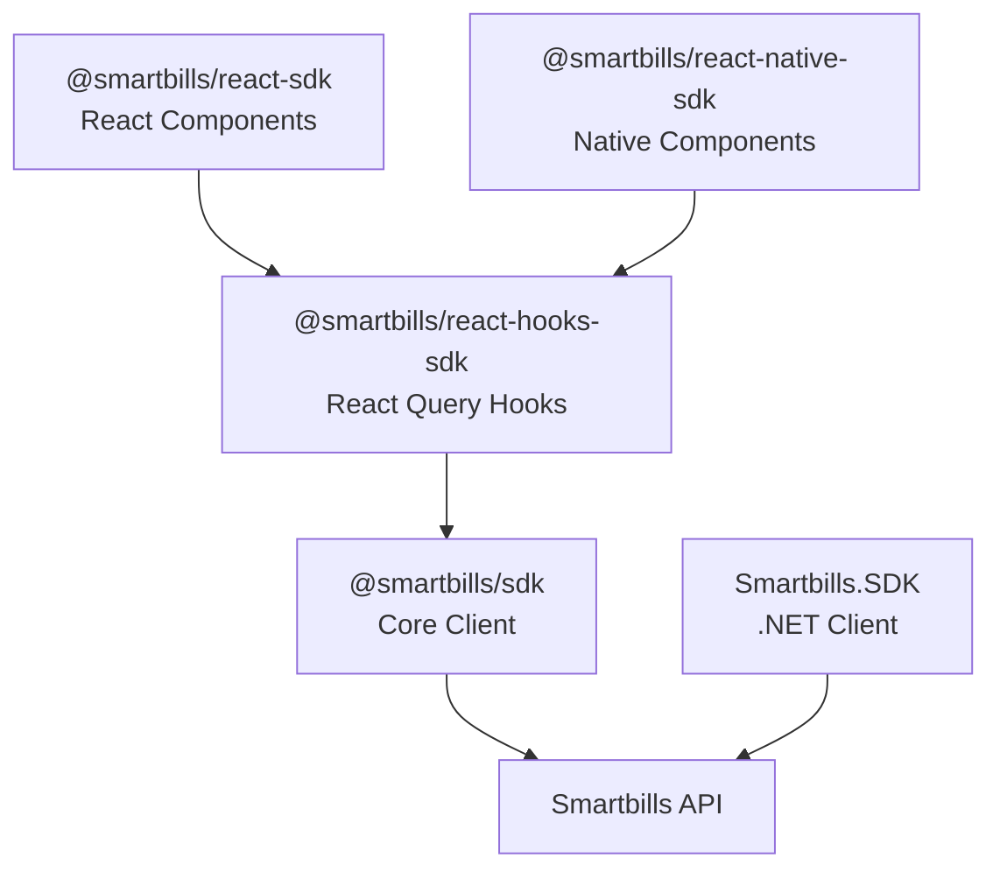

## Available SDKs

Smartbills provides official SDKs for JavaScript, TypeScript, React, React Native, and .NET to help you integrate expense management, digital receipts, and financial automation into your applications.

<CardGroup cols={2}>
  <Card title="JavaScript SDK" icon="js" href="/sdks/javascript">
    Core SDK for Node.js and browser applications — `@smartbills/sdk`
  </Card>
  <Card title="React SDK" icon="react" href="/sdks/react">
    React Query hooks and components — `@smartbills/react-hooks-sdk`
  </Card>
  <Card title="React Native SDK" icon="mobile" href="/sdks/react-native">
    Native receipt display and mobile components — `@smartbills/react-native-sdk`
  </Card>
  <Card title=".NET SDK" icon="microsoft" href="/sdks/dotnet">
    C# SDK for .NET applications — `Smartbills.SDK`
  </Card>
</CardGroup>

## Installation

<CodeGroup>

```bash JavaScript / TypeScript
npm install @smartbills/sdk
```

```bash React (Hooks)
npm install @smartbills/sdk @smartbills/react-hooks-sdk @tanstack/react-query
```

```bash React (Components)
npm install @smartbills/react-sdk
```

```bash React Native
npm install @smartbills/react-native-sdk @smartbills/react-hooks-sdk @smartbills/sdk
```

```bash .NET
dotnet add package Smartbills.SDK
```

</CodeGroup>

## Quick Start

All SDKs use the same `SmartbillsClient` for initialization:

<CodeGroup>

```typescript JavaScript
import { SmartbillsClient } from "@smartbills/sdk";

const client = new SmartbillsClient({
  accessToken: "your-access-token",
  businessId: 42,
});

const { data } = await client.expenses.listBusiness({ limit: 25 });
```

```tsx React
import { SmartbillsProvider, useExpenses } from "@smartbills/react-hooks-sdk";
import { SmartbillsClient } from "@smartbills/sdk";

const client = new SmartbillsClient({ accessToken: "token", businessId: 42 });

function App() {
  return (
    <SmartbillsProvider client={client} businessId={42}>
      <ExpenseList />
    </SmartbillsProvider>
  );
}

function ExpenseList() {
  const { data, isLoading } = useExpenses({ limit: 25 });
  if (isLoading) return <div>Loading...</div>;
  return <ul>{data?.pages.flatMap(p => p.data).map(e => <li key={e.id}>{e.vendor?.name}</li>)}</ul>;
}
```

```csharp C#
using Smartbills.SDK;

var client = new SmartbillsClient(new SmartbillsClientOptions
{
    AccessToken = "your-access-token",
    BusinessId = 42
});

var expenses = await client.Expenses.ListBusinessAsync(
    new ExpenseListRequest { Limit = 25 }
);
```

</CodeGroup>

## SDK Architecture



## Authentication

All SDKs use OAuth 2.0 bearer tokens:

| Method | Use Case |
|--------|----------|
| Access Token | Server-side and client-side applications |
| OAuth 2.0 Flow | User-facing applications requiring login |

## Features

### Common Features

- **Type Safety** — Full TypeScript / C# type definitions
- **Error Handling** — Typed error classes with guards (`isNotFoundError`, `isValidationError`, etc.)
- **Pagination** — Built-in support for paginated list endpoints
- **Retry Logic** — Automatic retry for transient failures with configurable backoff
- **Rate Limiting** — Automatic rate limit handling

### Feature Matrix

| Feature | JS SDK | React Hooks | React Components | React Native | .NET |
|---------|--------|-------------|-----------------|--------------|------|
| Expense CRUD | Yes | Yes | — | Yes | Yes |
| Bulk Operations | Yes | Yes | — | Yes | Yes |
| Presigned Upload | Yes | Yes | — | Yes | — |
| Receipt Display | — | — | Yes | Yes | — |
| Barcode / QR Code | — | — | — | Yes | — |
| Infinite Scroll | — | Yes | — | Yes | — |
| Optimistic Updates | — | Yes | — | Yes | — |

## Version Compatibility

| SDK | Minimum Runtime | API Version |
|-----|----------------|-------------|
| `@smartbills/sdk` | Node.js 16+ / Modern browsers | v1 |
| `@smartbills/react-hooks-sdk` | React 18+ | v1 |
| `@smartbills/react-sdk` | React 18+ | v1 |
| `@smartbills/react-native-sdk` | React Native 0.70+ / Expo 49+ | v1 |
| `Smartbills.SDK` | .NET 6+ | v1 |

## Support

<CardGroup cols={2}>
  <Card title="GitHub" icon="github" href="https://github.com/smartbills">
    Report bugs and request features
  </Card>
  <Card title="Community" icon="slack" href="https://community.smartbills.io">
    Get help from the community
  </Card>
</CardGroup>
